# Guide utilisateur — WWF Procurement App

**Système de gestion des achats électroniques (e-procurement)**
Cycle complet : Réquisition → Approbation → Commande → Réception (GRN) → Acceptation (SAN) → Facture → Paiement

---

## Sommaire

1. [Connexion](#1-connexion)
2. [Tableau de bord](#2-tableau-de-bord)
3. [Étape 1 — Créer une réquisition](#3-étape-1--créer-une-réquisition)
4. [Étape 2 — Circuit d'approbation](#4-étape-2--circuit-dapprobation)
5. [Étape 3 — Bon de commande (PO)](#5-étape-3--bon-de-commande-po)
6. [Étape 4 — Bon de réception (GRN)](#6-étape-4--bon-de-réception-grn)
7. [Étape 5 — Acceptation de service (SAN)](#7-étape-5--acceptation-de-service-san)
8. [Étape 6 — Facture et rapprochement 3 voies](#8-étape-6--facture-et-rapprochement-3-voies)
9. [Étape 7 — Paiement](#9-étape-7--paiement)
10. [Mes tâches — Comment GoFlow pilote le workflow](#10-mes-tâches--comment-goflow-pilote-le-workflow)
11. [Profils et permissions](#11-profils-et-permissions)
12. [Cas particuliers](#12-cas-particuliers)
13. [Navigation et recherche](#13-navigation-et-recherche)

---

## 1. Connexion

Accédez à l'application via votre navigateur. La page d'accueil affiche le formulaire de connexion.

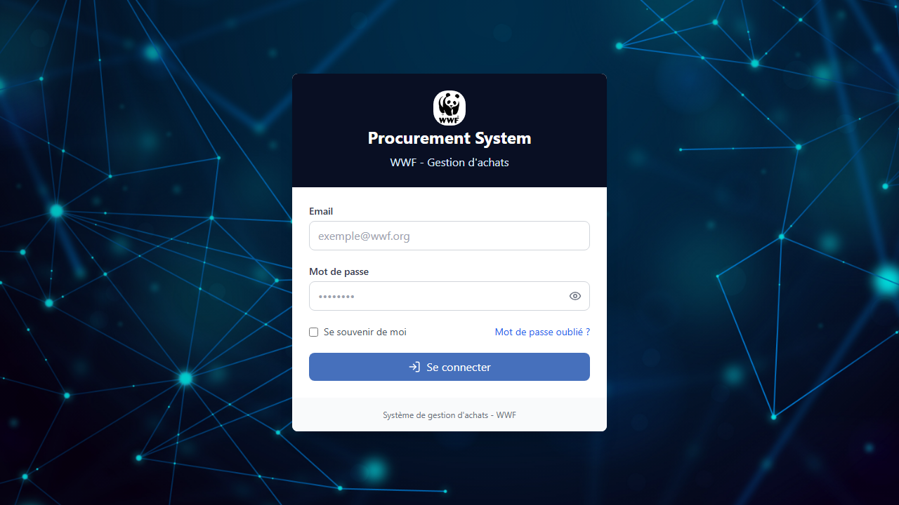

**Champs requis :**
- **Email** — adresse e-mail de votre compte (ex. `admin@procurement.com`)
- **Mot de passe** — fourni par l'administrateur système

Cochez **Se souvenir de moi** pour maintenir la session active entre les navigations. Cliquez sur **Se connecter** pour accéder au tableau de bord.

> Si vous avez oublié votre mot de passe, cliquez sur **Mot de passe oublié ?** pour demander une réinitialisation.

---

## 2. Tableau de bord

Après connexion, vous arrivez sur le tableau de bord qui centralise les indicateurs clés de la chaîne d'approvisionnement.

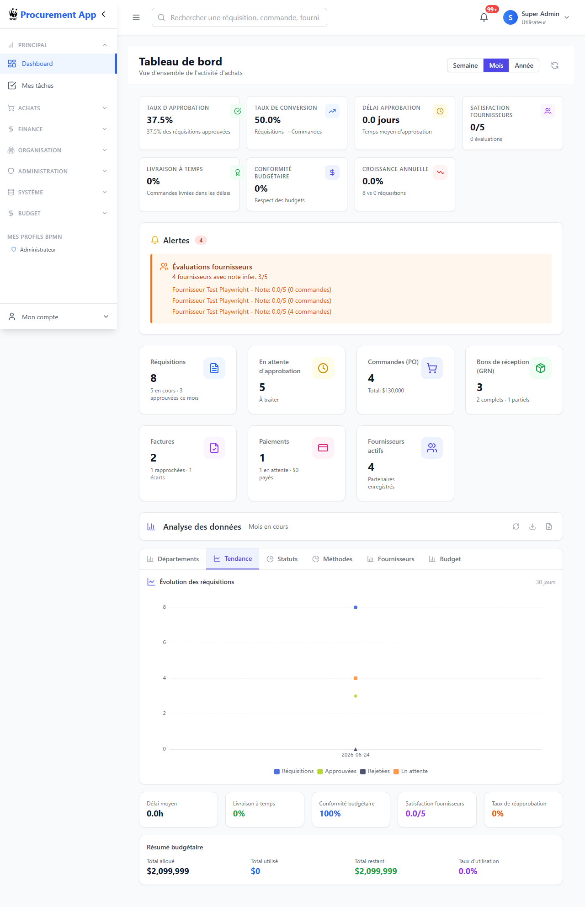

### Indicateurs de performance (KPIs)

| Indicateur | Description |
|------------|-------------|
| **Taux de compression** | % de réquisitions converties en commandes |
| **Flux de conversion** | Taux réquisitions → commandes approuvées |
| **Délai moyen** | Durée moyenne du cycle d'approbation (jours) |
| **Satisfaction fournisseurs** | Note globale sur 5 |

### Alertes

La section **Alertes** signale les évaluations fournisseurs en retard, les réquisitions bloquées et les livraisons partielles en attente.

### Analyse des données

Le panneau inférieur propose des graphiques interactifs filtrables par département, statuts, méthodes d'achat, fournisseurs et lignes budgétaires.

---

## 3. Étape 1 — Créer une réquisition

La réquisition est le point de départ de tout achat. Elle est créée par le **Demandeur** (profil `requester`).

### Accès

Depuis la sidebar : **ACHATS → Réquisitions → + Nouvelle réquisition**

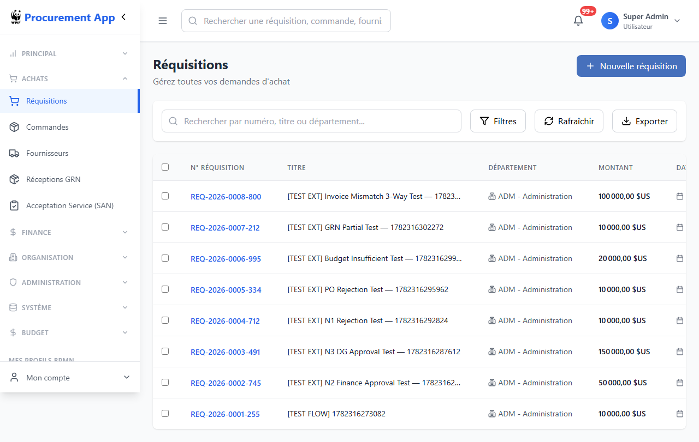

La liste affiche toutes les réquisitions avec leur numéro (format `REQ-AAAA-NNNN`), département, montant et statut actuel.

### Formulaire de création

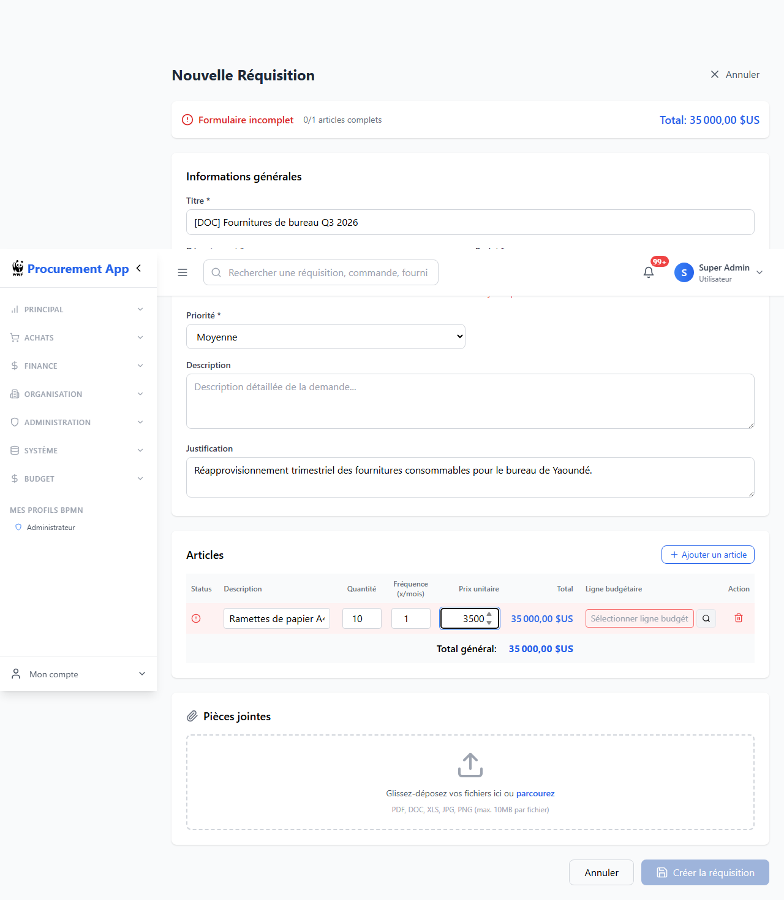

**Informations générales (obligatoires) :**

| Champ | Description |
|-------|-------------|
| **Titre** | Nom court et descriptif de la demande |
| **Département** | Service émetteur de la demande |
| **Projet** | Projet budgétaire rattaché |
| **Priorité** | Basse / Moyenne / Haute / Urgente |
| **Description** | Détail de la demande |
| **Justification** | Motivation métier de l'achat |

**Articles :**

Ajoutez un ou plusieurs articles via **+ Ajouter un article**. Pour chaque article :
- **Description** — libellé de l'article
- **Quantité** et **Fréquence (x/mois)** — volume et récurrence
- **Prix unitaire** — coût estimé unitaire
- **Ligne budgétaire** — imputation budgétaire (sélecteur ou recherche)

Le **Total général** se calcule automatiquement.

**Pièces jointes :** Glissez-déposez des fichiers (PDF, DOC, XLS, JPG, PNG — max. 10 Mo) pour joindre devis, cahier des charges ou tout document justificatif.

Cliquez sur **Créer la réquisition** pour soumettre. Le workflow GoFlow démarre immédiatement.

### Statuts possibles

| Statut | Signification |
|--------|---------------|
| `DRAFT` | Brouillon, non encore soumis |
| `IN_PROGRESS` | Soumis, workflow en cours |
| `BUDGET_INSUFFICIENT` | Budget insuffisant détecté automatiquement |
| `PENDING_APPROVAL` | En attente d'approbation |
| `APPROVED` | Approuvé par le circuit complet |
| `REJECTED` | Rejeté par un approbateur |

---

## 4. Étape 2 — Circuit d'approbation

Dès qu'une réquisition est soumise, GoFlow déclenche automatiquement la vérification du budget et achemine la tâche vers le bon approbateur selon le montant.

### Seuils d'approbation

| Montant estimé | Approbateur requis | Profil |
|---------------|--------------------|--------|
| < 25 000 | Manager N1 | `manager` |
| 25 000 – 99 999 | Finance N2 | `finance` |
| ≥ 100 000 | Directeur Général N3 | `dg` |

### Mes tâches

Depuis la sidebar : **PRINCIPAL → Mes tâches**

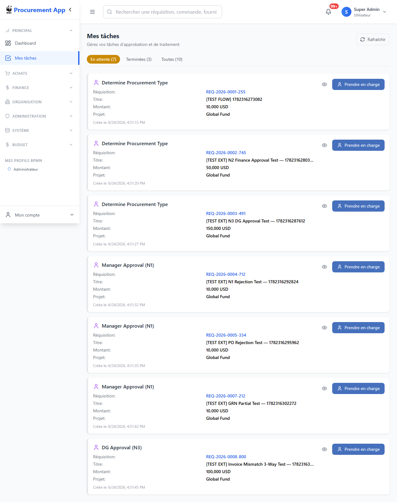

Chaque tâche affiche le numéro de réquisition, le département, le montant et la date de création. Cliquez sur **Traiter** pour ouvrir le formulaire de décision.


**Actions disponibles :**
- **Approuver** — la réquisition avance à l'étape suivante
- **Rejeter** — la réquisition passe en statut `REJECTED`, le demandeur en est notifié

### Résultat après approbation

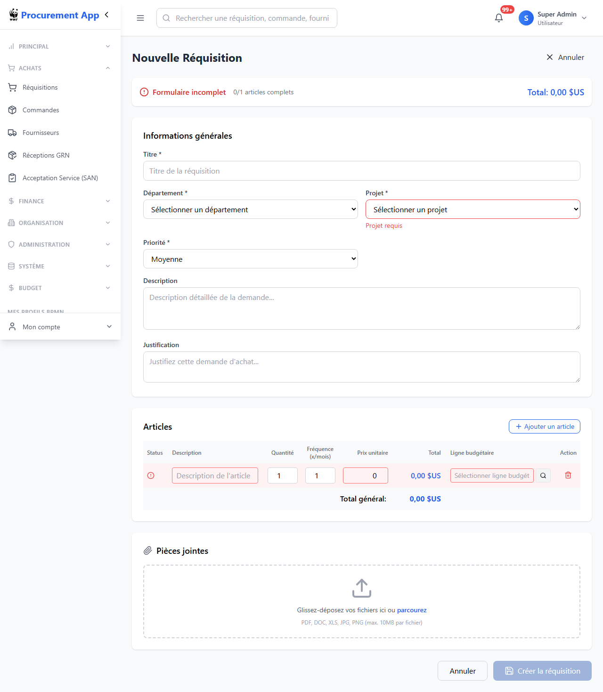

Une réquisition approuvée affiche le statut `APPROVED` et devient disponible pour la création d'un bon de commande.

---

## 5. Étape 3 — Bon de commande (PO)

Une fois la réquisition approuvée, le service **Achats** (profil `procurement`) crée le bon de commande.

### Accès

Depuis la sidebar : **ACHATS → Commandes → + Nouvelle commande**

Ou directement depuis le détail d'une réquisition approuvée via le bouton **Créer une commande**.

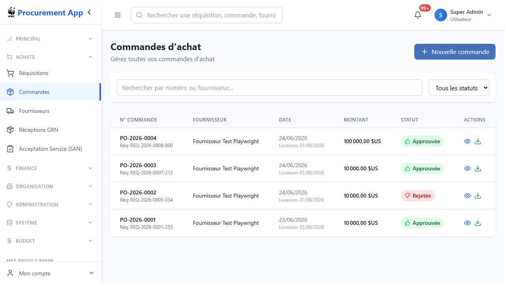

La liste affiche le numéro de PO (format `PO-AAAA-NNNN`), le fournisseur, la date, le montant et le statut.

### Formulaire de création

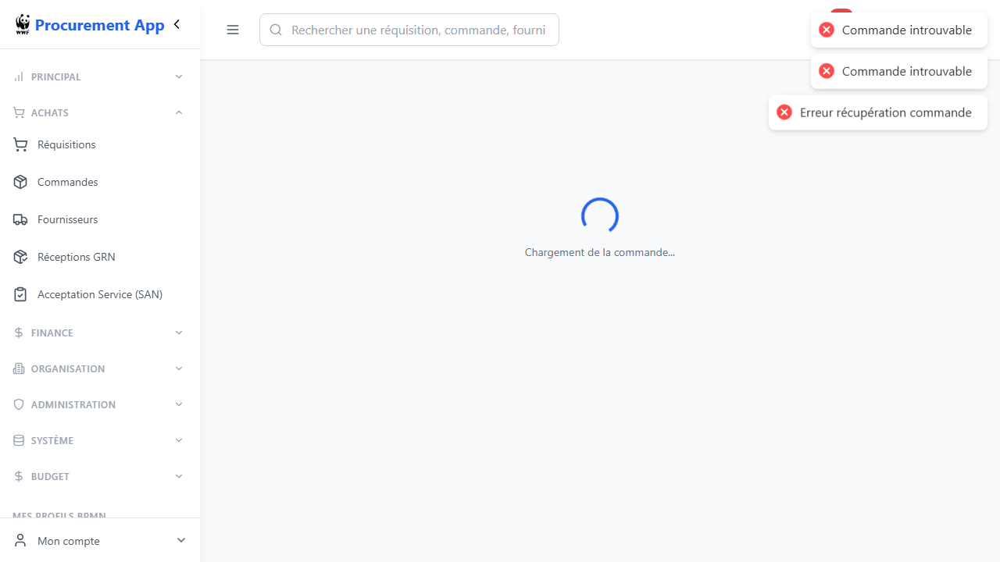

Renseignez le fournisseur, la date de commande, la date de livraison prévue et les articles. Le formulaire pré-remplit les articles depuis la réquisition liée si disponible.

### Détail d'un bon de commande


Le détail du PO affiche :
- Les informations fournisseur et de livraison
- La liste des articles avec quantités et prix
- L'historique des approbations
- Le **panneau Flux P2P** (visible dès que le PO est approuvé) — voir ci-dessous

### Panneau Flux P2P (lecture seule)

Dès qu'un PO est au statut `PO_APPROVED` ou supérieur, un panneau **Flux P2P** apparaît dans la colonne droite. Il affiche en lecture seule :
- Les **bons de réception (GRN)** liés à ce PO, avec leur statut
- Les **acceptations de service (SAN)** liées, avec leur statut

> **Important :** Ce panneau est informatif uniquement. Les actions de création (GRN, SAN, Facture, Paiement) sont déclenchées par GoFlow et apparaissent dans **Mes tâches** selon votre profil.

### Export PDF

Le bouton **PDF** en haut du détail génère un bon de commande complet au format A4 (logo, articles, total, signatures) téléchargeable immédiatement.

### Statuts du bon de commande

| Statut | Signification |
|--------|---------------|
| `DRAFT` | Brouillon en cours de rédaction |
| `PO_PENDING` | Soumis, en attente d'approbation management |
| `PO_APPROVED` | Approuvé — envoi fournisseur déclenché |
| `PO_REJECTED` | Rejeté par le management |
| `PO_SENT` | Envoyé au fournisseur par e-mail |
| `PO_RECEIVED` | Fournisseur a confirmé la réception |
| `PO_COMPLETE` | Cycle P2P terminé |

### Approbation PO

Le management (profil `management`) reçoit une tâche GoFlow **Approuver Purchase Order** dans **Mes tâches**. L'approbation envoie automatiquement le bon de commande au fournisseur par e-mail.

---

## 6. Étape 4 — Bon de réception (GRN)

Quand les marchandises arrivent, la **Logistique** (profil `logistic`) enregistre la réception physique via un Goods Receipt Note (GRN).

### Comment y accéder

GoFlow crée automatiquement la tâche **Goods Receipt Note (GRN)** dans **Mes tâches** pour tous les utilisateurs du profil `logistic`, après confirmation du fournisseur.

Depuis la sidebar **PRINCIPAL → Mes tâches**, cliquez sur **Ouvrir le formulaire** sur la tâche GRN. Vous êtes redirigé vers le formulaire GRN pré-configuré avec la commande liée.

> **Note :** Le formulaire peut aussi être accessible via **ACHATS → Réceptions GRN → + Nouveau GRN** (usage administratif ou correction), mais dans ce cas la tâche GoFlow correspondante ne sera pas complétée automatiquement.

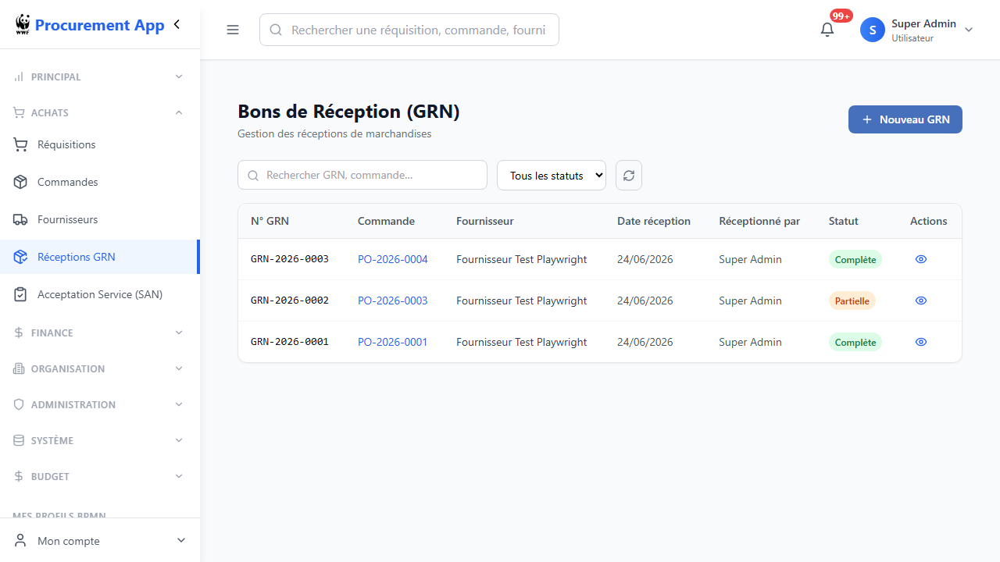

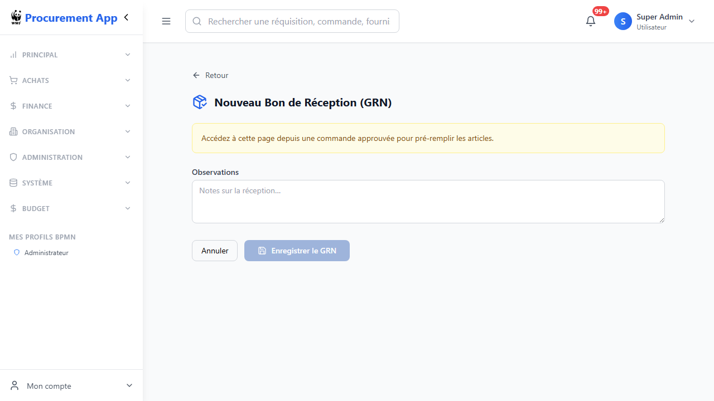


### Champs du formulaire GRN

| Champ | Description |
|-------|-------------|
| **Commande (PO)** | Pré-rempli automatiquement depuis la tâche GoFlow |
| **Observations** | Notes libres sur la réception (état des colis, conditions, etc.) |
| **Articles reçus** | Pour chaque ligne : quantité reçue, acceptée, rejetée, motif de rejet |

### Statuts GRN

| Statut | Signification |
|--------|---------------|
| `COMPLETE` | Tous les articles reçus et acceptés |
| `PARTIAL` | Des articles ont été rejetés (endommagés, non conformes) |
| `PENDING` | Aucun article enregistré |

Une fois soumis, GoFlow avance automatiquement à l'étape suivante : l'**Acceptation de service (SAN)**.

---

## 7. Étape 5 — Acceptation de service (SAN)

Après la réception physique, le **Demandeur** (profil `requester`) confirme que la prestation ou la livraison est conforme à ce qui a été commandé.

### Comment y accéder

GoFlow crée la tâche **Service Acceptance Note (SAN)** dans **Mes tâches** pour l'utilisateur `requester` ayant initié la réquisition.

Cliquez sur **Ouvrir le formulaire** sur la tâche SAN. Vous êtes redirigé vers le formulaire d'acceptation avec le PO pré-rempli.

> Le formulaire SAN est aussi consultable via **ACHATS → Acceptation Service (SAN)** dans la sidebar (liste en lecture seule).

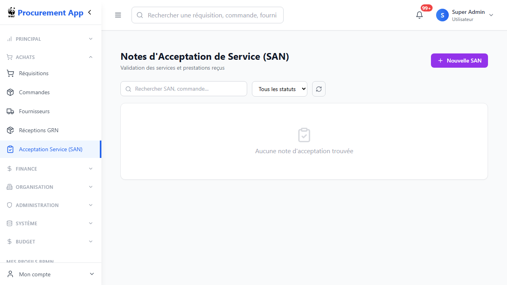

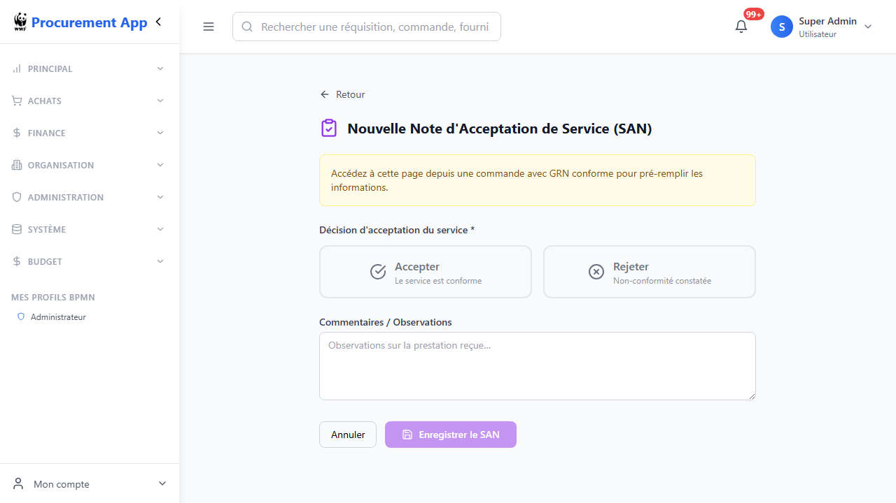

### Formulaire SAN

Le formulaire présente deux options claires :

- **Accepter** — la prestation / livraison est conforme, le workflow avance vers la saisie de facture
- **Rejeter** — la prestation n'est pas conforme ; un motif de rejet est obligatoire

### Statuts SAN

| Statut | Signification |
|--------|---------------|
| `ACCEPTED` | Prestation acceptée — GoFlow avance vers la facturation |
| `REJECTED` | Prestation rejetée — litige à résoudre avec le fournisseur |
| `DRAFT` | Créé mais décision non encore enregistrée |

---

## 8. Étape 6 — Facture et rapprochement 3 voies

Le service **Finance** (profil `finance`) saisit la facture fournisseur. Le système effectue automatiquement un **rapprochement 3 voies** (PO + GRN + Facture) à l'enregistrement.

### Comment y accéder

GoFlow crée la tâche **Enter Supplier Invoice** dans **Mes tâches** pour les utilisateurs `finance`, après acceptation du service (SAN).

Cliquez sur **Ouvrir le formulaire** sur la tâche Facture. Vous êtes redirigé vers le formulaire pré-configuré avec la commande liée.

> Le formulaire est aussi accessible via **FINANCE → Factures → + Nouvelle facture** (usage administratif).

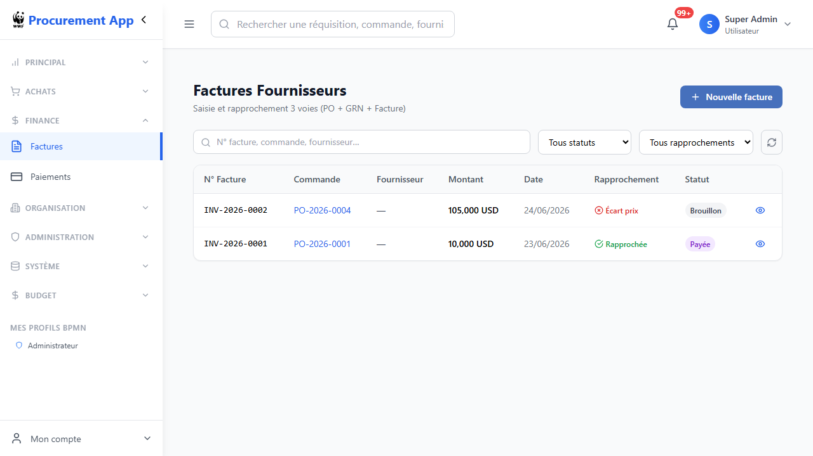

La liste affiche le N° de facture, la commande liée, le fournisseur, le montant, la date, le résultat du rapprochement et le statut de paiement.

### Formulaire de saisie

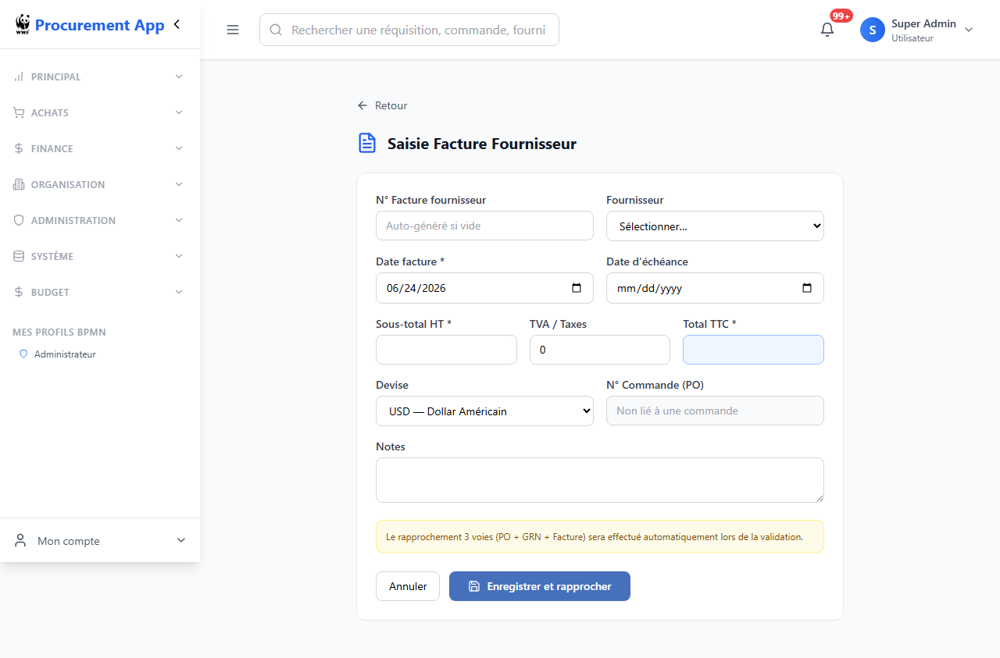

| Champ | Description |
|-------|-------------|
| **N° Facture fournisseur** | Référence de la facture reçue |
| **Fournisseur** | Sélection dans le référentiel |
| **Date facture** | Date d'émission de la facture |
| **Date d'échéance** | Date limite de paiement |
| **Sous-total HT** | Montant hors taxes |
| **TVA / Taxes** | Montant de la TVA applicable |
| **Total TTC** | Montant total à payer |
| **Devise** | XAF, USD, EUR, GBP |
| **N° Commande (PO)** | Lien avec le bon de commande |

Cliquez sur **Enregistrer et rapprocher** pour déclencher le rapprochement 3 voies.

### Résultats du rapprochement

| Résultat | Signification |
|----------|---------------|
| `MATCHED` (Rapprochée) | Facture conforme — PO, GRN et montants cohérents |
| `PRICE_MISMATCH` (Écart prix) | Montant facture > montant PO + tolérance 2% |
| `PENDING` | Rapprochement pas encore effectué |

> **Tolérance :** Un écart de ±2% entre la facture et le PO est accepté automatiquement.

---

## 9. Étape 7 — Paiement

Une fois la facture rapprochée (`MATCHED`), le service Finance enregistre le paiement.

### Comment y accéder

GoFlow crée la tâche **Process Payment** dans **Mes tâches** pour les utilisateurs `finance`, après validation du rapprochement.

Cliquez sur **Ouvrir le formulaire** sur la tâche Paiement. Le formulaire est pré-rempli avec les informations de la facture.

> Accessible aussi via **FINANCE → Paiements → + Nouveau paiement** ou depuis le bouton **Payer** sur le détail d'une facture.

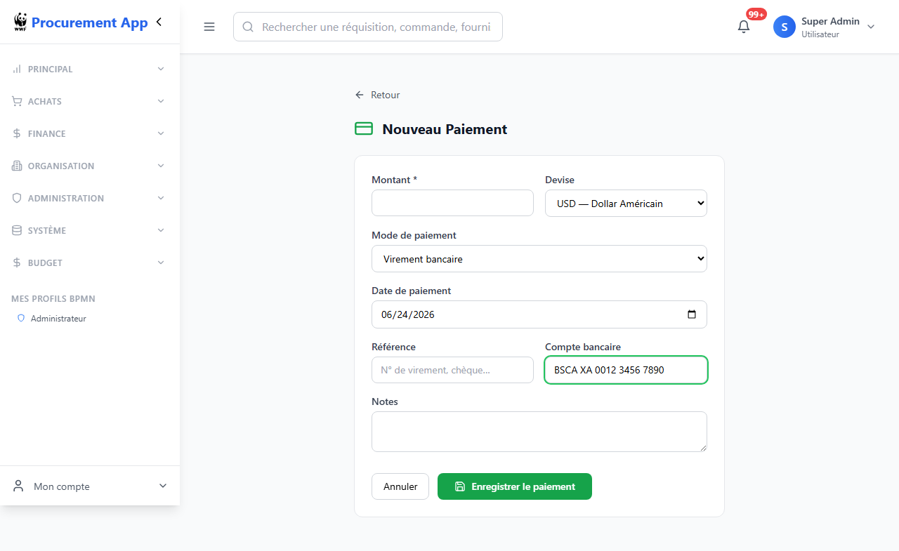

| Champ | Description |
|-------|-------------|
| **Montant** | Montant à régler (pré-rempli depuis la facture) |
| **Devise** | XAF, USD, EUR, GBP |
| **Mode de paiement** | Virement bancaire / Chèque / Espèces / Mobile Money |
| **Date de paiement** | Date d'exécution du paiement |
| **Référence** | N° de virement, de chèque ou autre référence externe |
| **Compte bancaire** | IBAN ou numéro de compte destinataire |
| **Notes** | Informations complémentaires |

Cliquez sur **Enregistrer le paiement** pour finaliser. La facture passe en statut `PAYÉE`.

### Liste des paiements

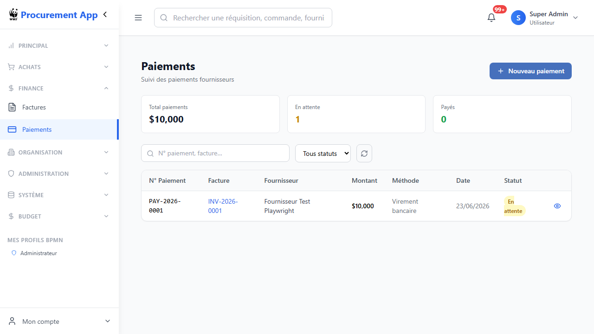

La liste affiche les 3 cartes de résumé en haut (total engagé, paiements en attente, paiements effectués) et le détail de chaque paiement avec son lien vers la facture.

### Statuts des paiements

| Statut | Signification |
|--------|---------------|
| `PENDING` (En attente) | Paiement enregistré, en attente d'exécution bancaire |
| `COMPLETED` (Payé) | Paiement confirmé et exécuté |
| `CANCELLED` | Paiement annulé |

---

## 10. Mes tâches — Comment GoFlow pilote le workflow

**GoFlow (Camunda) est le moteur qui orchestre toutes les étapes du cycle P2P.** Chaque action débloque automatiquement la suivante, dans le bon ordre, pour le bon utilisateur.

### Principe de fonctionnement

```
Réquisition soumise
  → GoFlow vérifie le budget automatiquement
  → GoFlow crée la tâche d'approbation (N1/N2/N3 selon le montant)
  → Approbation accordée
  → GoFlow crée la tâche "Create PO" pour les Achats
  → PO approuvé + envoyé fournisseur
  → GoFlow crée la tâche "GRN" pour la Logistique
  → GRN enregistré
  → GoFlow crée la tâche "SAN" pour le Demandeur
  → Service accepté
  → GoFlow crée la tâche "Facture" pour la Finance
  → Facture rapprochée
  → GoFlow crée la tâche "Paiement" pour la Finance
```

### Types de tâches dans Mes tâches

| Bouton affiché | Comportement | Tâches concernées |
|---|---|---|
| **Traiter** | Ouvre une modale de décision | Approbations N1/N2/N3, Approbation PO, Méthode d'achat |
| **Ouvrir le formulaire** | Redirige vers le formulaire dédié | GRN, SAN, Facture, Paiement |

### Prendre en charge une tâche

Si une tâche affiche le bouton **Prendre en charge**, cela signifie qu'elle n'est pas encore assignée à un utilisateur précis (elle est disponible pour tout le groupe). Cliquez sur **Prendre en charge** pour vous l'assigner, puis sur **Ouvrir le formulaire** ou **Traiter** pour la traiter.

### Filtres dans Mes tâches

- **En attente** — tâches à traiter
- **Terminées** — tâches déjà complétées
- **Toutes** — vue complète

---

## 11. Profils et permissions

L'application gère les accès par profil. Chaque utilisateur se voit attribuer un ou plusieurs profils lors de la création de son compte.

| Profil | Rôle | Tâches GoFlow reçues |
|--------|------|----------------------|
| `prof_requester` | Demandeur | Créer réquisitions, **SAN** (acceptation service) |
| `prof_manager` | Manager N1 | Approbation réquisitions < 25 000 |
| `prof_finance` | Finance N2 | Approbation réquisitions 25k–100k, **Saisie facture**, **Paiement** |
| `prof_dg` | Directeur Général N3 | Approbation réquisitions ≥ 100 000 |
| `prof_procurement` | Achats | Création PO, méthode d'achat, devis, RFP |
| `prof_management` | Management | Approbation bons de commande |
| `prof_logistic` | Logistique | **GRN** (réception marchandises) |
| `prof_admin` | Administrateur | Accès complet, gestion des utilisateurs |

> La section **MES PROFILS BPMN** en bas de la sidebar affiche vos profils GoFlow actifs.

---

## 12. Cas particuliers

### Budget insuffisant

Si une réquisition est soumise sans ligne budgétaire valide ou si le budget est épuisé, GoFlow détecte automatiquement l'insuffisance. La réquisition passe en statut `BUDGET_INSUFFICIENT` et le demandeur reçoit une tâche **Budget Adjustment** dans Mes tâches pour ajustement.

### Réquisition rejetée

Lorsqu'un approbateur rejette une réquisition, le statut passe à `REJECTED`. Le demandeur peut consulter le motif dans le détail de la réquisition et créer une nouvelle demande révisée.

### Bon de commande rejeté

Si le management rejette le PO, son statut passe à `PO_REJECTED`. L'équipe Achats doit créer un nouveau PO corrigé depuis la réquisition approuvée.

### GRN partielle (articles endommagés)

Si des articles sont endommagés ou non conformes à la réception, renseignez une **quantité rejetée** et un **motif de rejet** pour chaque ligne concernée. Le GRN prend le statut `PARTIAL`, ce qui est tracé dans le rapprochement 3 voies.

### Service rejeté (SAN rejeté)

Si le demandeur rejette le service via le SAN, le workflow s'arrête et une procédure de litige avec le fournisseur doit être engagée manuellement. Le motif de rejet est conservé dans le détail du SAN.

### Écart de prix sur facture

Si le montant de la facture dépasse le PO de plus de 2%, le rapprochement retourne `PRICE_MISMATCH`. Dans ce cas :
1. Vérifiez le montant avec le fournisseur
2. Si l'écart est justifié, demandez un avenant au PO
3. Saisissez une facture rectifiée

---

## 13. Navigation et recherche

### Barre de recherche globale

La barre de recherche en haut de page (raccourci clavier `Ctrl+K`) permet de rechercher une **réquisition**, une **commande** ou un **fournisseur** depuis n'importe quelle page.

### Menu latéral (sidebar)

| Section | Contenu |
|---------|---------|
| **PRINCIPAL** | Tableau de bord, Mes tâches |
| **ACHATS** | Réquisitions, Commandes (PO), Fournisseurs, Réceptions (GRN), Acceptation Service (SAN) |
| **FINANCE** | Factures, Paiements |
| **ORGANISATION** | Départements, Projets, Utilisateurs |
| **ADMINISTRATION** | Paramètres système |
| **BUDGET** | Lignes budgétaires |

Cliquez sur la flèche `<` en haut du menu pour replier la sidebar et gagner de l'espace.

### Notifications

L'icône cloche en haut à droite affiche le nombre de notifications non lues. Les événements notifiés incluent : nouvelles tâches à traiter, changements de statut, alertes fournisseurs.

### Filtres et export

Chaque liste propose :
- Un **champ de recherche** par numéro, fournisseur ou département
- Un **filtre par statut** (liste déroulante)
- Un bouton **Actualiser** pour recharger les données en temps réel
- Sur les réquisitions : un bouton **Exporter** (Excel/CSV)
- Sur les bons de commande : un bouton **PDF** pour exporter le bon de commande au format A4

---

*Documentation mise à jour le 24/06/2026 — WWF Procurement App v1.1*
